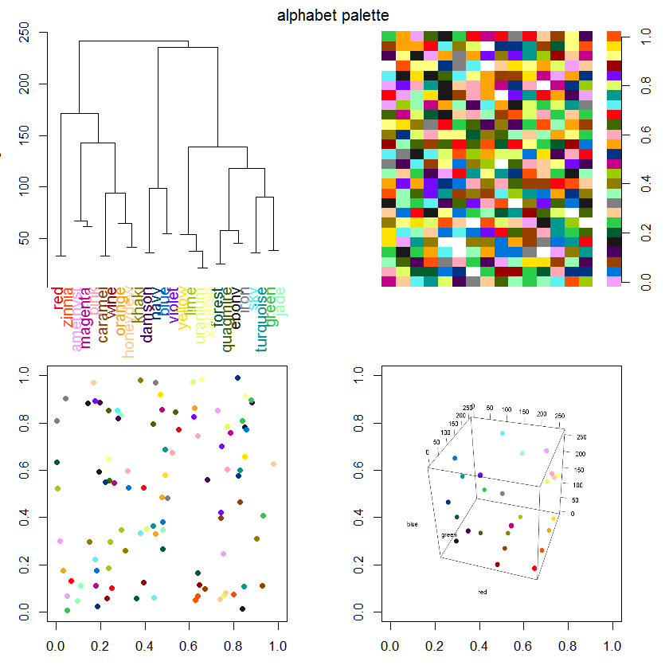
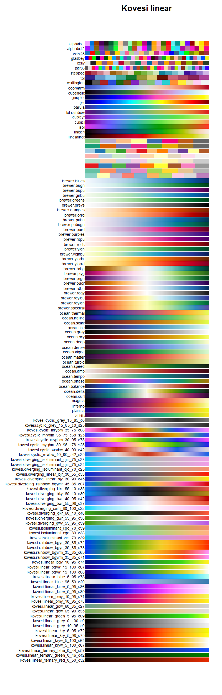

# pals 

[](https://cran.r-project.org/package=pals)
[](https://cranlogs.r-pkg.org/badges/pals)
[](http://depsy.org/package/r/pals)

Color Palettes, Colormaps, and Tools to Evaluate Them

Key features:

* Extensive collection of colormaps and palettes.

* Multiple tools to evaluate colormaps.

* Conscientous memory use.

* Consistency: All palettes and colormaps are _functions_, with all lower-case names.

## Installation

```R
# Install the released version from CRAN:
install.packages("pals")

# Install the development version from GitHub:
# install.packages("devtools")
devtools::install_github("kwstat/pals")
```

## Vignettes

[Overview of the pals package](https://rawgit.com/kwstat/pals/master/vignettes/pals_examples.html)

[A Color-caused optical illusion](https://rawgit.com/kwstat/pals/master/vignettes/illusion.html)

[Bivariate choropleths](https://rawgit.com/kwstat/pals/master/vignettes/bivariate_choropleths.html)

## Usage

Tools for testing colormap and palette effectiveness.




Catalog of colormaps and palettes included in the package.


