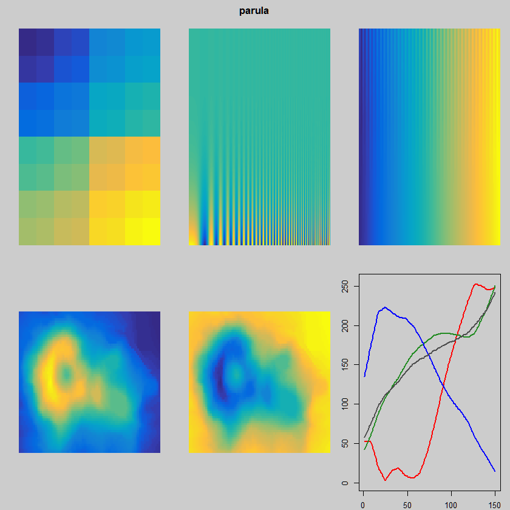

# pals 

[](https://cran.r-project.org/package=pals)
[](https://cranlogs.r-pkg.org/badges/pals)


Homepage: https://kwstat.github.io/pals

Repository: https://github.com/kwstat/pals

Color Palettes, Colormaps, and Tools to Evaluate Them

Key features:

* Extensive collection of colormaps and palettes.

* Multiple tools to evaluate colormaps.

* Conscientious memory use.

* Consistency: All palettes and colormaps are _functions_, with all lower-case names.

## Installation

```R
# Install the released version from CRAN:
install.packages("pals")

# Install the development version from GitHub:
# install.packages("devtools")
devtools::install_github("kwstat/pals")
```

## Usage

Tools for testing colormap and palette effectiveness.




Catalog of colormaps and palettes included in the package.


## Similar packages

See the paletteer package https://github.com/EmilHvitfeldt/paletteer
