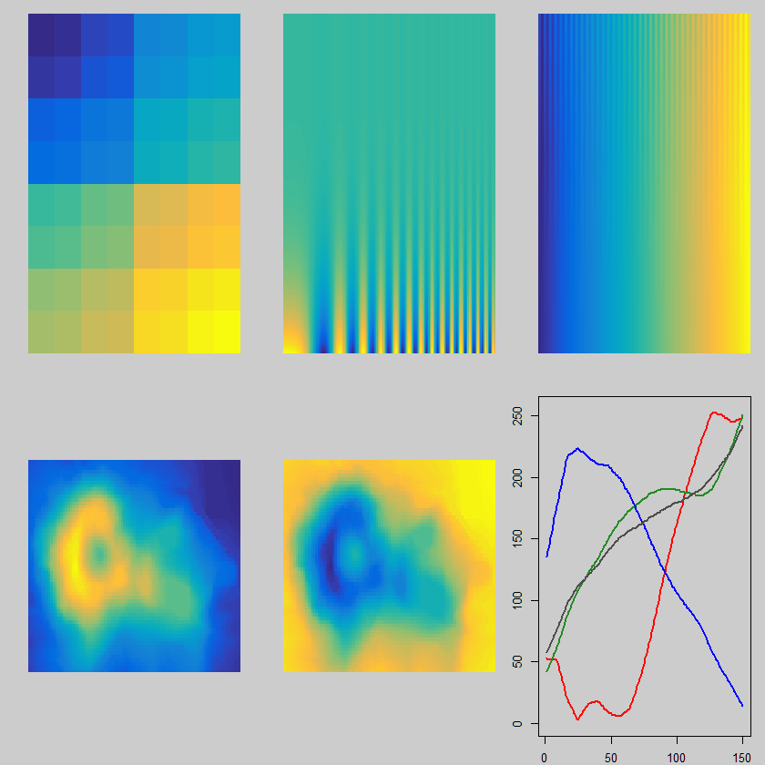

# pals

[](https://cran.r-project.org/package=pals)
[](https://cranlogs.r-pkg.org/badges/pals)

Color Palettes and Palette Evaluation Tools

Key features:

* Beta version.

## Installation

```R
# Install the released version from CRAN:
install.packages("pals")

# Install the cutting edge development version from GitHub:
# install.packages("devtools")
devtools::install_github("kwstat/pals")
```

## Usage

Vignette:
[Examples for the pals package](https://rawgit.com/kwstat/pals/master/vignettes/pals_examples.html)

```R
require(pals)
pal.test(parula)
```

